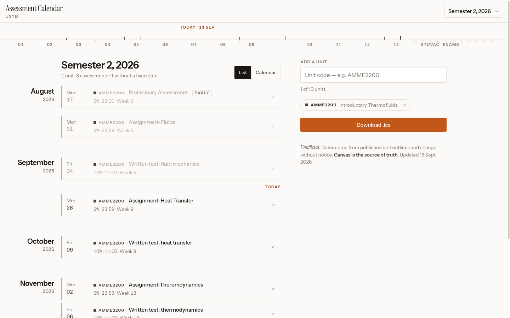

# USyd Assessment Calendar

Type in your University of Sydney unit codes for a semester and get every assessment due date in
one list, on a calendar grid, and as a `.ics` file you can import into Google Calendar, Apple
Calendar or Outlook.

**Unofficial.** This project is not affiliated with, endorsed by, or maintained by the University
of Sydney. Dates are read from the University's public unit outline pages and change without
notice. Canvas is the source of truth. Every assessment shown links back to the outline page it
came from.



## How it works

There is no server. A scheduled GitHub Actions job runs the Python scraper, which reads the public
unit outline pages, writes static JSON into `data/`, and commits it. The website is plain HTML,
CSS and JavaScript that reads that JSON.

```
GitHub Actions (daily, 03:00 Sydney)          GitHub Pages
  scraper/  → sydney.edu.au                     index.html + js/
  → data/index.json, data/units/*.json          fetch('./data/index.json')
  → git commit + push                           → render list / calendar / .ics
```

Pipeline, in order:

1. `scraper/discover.py` reads the master unit listing (`/students/units/seo.html` and its
   pagination) and returns every unit code.
2. `scraper/availability.py` reads each unit's landing page and keeps the outline links for the
   target year.
3. `scraper/outline.py` parses each outline's assessment table into assessment records. Only
   assessment metadata is stored: no learning outcomes, no weekly schedule, no staff contact
   details.
4. `scraper/calendar_infer.py` derives the teaching-week calendar (`data/weeks.json`) from the
   assessments that carry both a week number and a date, so "Week 08" deadlines can be placed.
5. `scraper/build.py` runs the above with bounded concurrency, writes everything to a temporary
   directory, checks the failure thresholds, and only then swaps the result into `data/`.

The scraper is deliberately gentle: one request per second, at most two in flight, a descriptive
`User-Agent`, `robots.txt` honoured, and an on-disk cache so nothing is fetched more than once a
day.

## Running the site locally

No build step. Any static file server works:

```
python -m http.server 8000
```

Then open <http://localhost:8000/>. The page reads `./data/`, so run the server from the
repository root.

## Running the scraper locally

Python 3.11 or newer.

```
pip install -r scraper/requirements.txt
python -m pytest scraper/tests -q                       # parser tests against saved fixtures
python -m scraper.build --codes AMME2200,ELEC3204       # a few units, for development
python -m scraper.build --limit 300                     # first 300 codes from discovery
python -m scraper.build                                 # full run, roughly 1.5 to 2.5 hours
```

Useful flags: `--year 2027`, `--limit N`, `--also CODE1,CODE2` (add codes on top of discovery),
`--no-cache`, `--out ./data`, `--force` (see below), `-v` for request-level logging.

One-off helpers:

```
python -m scraper.outline --url https://www.sydney.edu.au/units/AMME2200/2026-S2C-ND-CC
python -m scraper.availability AMME2200
```

Set the environment variable `USYD_CONTACT` (an email address, say) to have it included in the
`User-Agent` alongside the repository URL. In GitHub Actions this comes from a repository
variable of the same name.

## When a run fails

A red workflow run is the alarm that the University changed their HTML. The build exits non-zero
and leaves the previous `data/` untouched when any of these happen:

- fewer than 2,000 unit codes discovered
- fewer than 500 units with a parsed current-year outline (full runs only)
- more than 10% of outline fetches failed
- more than 20% of outline pages parsed to zero assessments
- the new run found fewer than half as many units as the data already committed
  (pass `--force`, or set the `force` input to `yes` when running the workflow, to override)
- any uncaught exception

What to do:

1. The parser tests run before every scrape. If they fail, the outline page structure changed.
   Save a fresh copy of the AMME2200 outline over
   `scraper/tests/fixtures/outline_amme2200_2026s2.html` (remove any email addresses from it),
   run the tests, and fix `scraper/outline.py` until they pass again. The tests pin the exact
   values from that page, so they tell you what broke.
2. If discovery fails, compare `scraper/tests/fixtures/seo_page1.html` with the live page and
   update `scraper/discover.py`.
3. Rerun the workflow manually (Actions tab, "Scrape unit outlines", "Run workflow").

## Adding the next year

1. Change `TARGET_YEAR` in `scraper/config.py` (or set the `year` input when running the
   workflow, or the `USYD_YEAR` environment variable).
2. Update the `year` default in `.github/workflows/scrape.yml`.
3. After the first run, open `data/weeks.json` and spot-check the inferred Week 1 Monday for each
   session against <https://www.sydney.edu.au/students/key-dates.html>. If a session is wrong or
   marked `"confidence": "low"`, write the correct Mondays into `data/weeks.override.json`:

   ```json
   { "2027-S1C": { "1": "2027-02-22", "2": "2027-03-01", "13": "2027-05-31" } }
   ```

   Override entries take precedence and survive every scrape.

## Repository layout

```
index.html, styles.css, js/     the site (served from the repo root by GitHub Pages)
404.html                        styled not-found page
favicon.svg, favicon-32.png     favicon; og.png is the social preview image
tools/make_og.py                regenerates og.png and favicon-32.png
tools/ics_check.py              structural check of an exported .ics file
scraper/                        Python scraper package and its tests
data/                           generated JSON, committed by the workflow
.github/workflows/scrape.yml    the scheduled scrape
DEPLOY.md                       click-by-click guide to going live on GitHub Pages
```

## Data files

- `data/meta.json`: when the data was generated, counts, and the scraper version.
- `data/index.json`: one entry per unit availability with a published outline. Loaded on every
  visit, kept small.
- `data/units/{CODE}-{AVAILABILITY}.json`: the assessments for one availability.
- `data/weeks.json`: teaching week to Monday date, per session, with a confidence flag.
- `data/weeks.override.json`: optional hand-maintained corrections.

## Deployment

See [DEPLOY.md](DEPLOY.md) for GitHub Pages, step by step. Cloudflare Pages also works: connect
the repository, leave the build command empty, set the output directory to `/`.

## Conduct

The scraper identifies itself, rate-limits, respects `robots.txt`, caches, and stores only
assessment metadata. Outline pages are marked `noindex` by the University; this site does not
republish them, it links to them.

## Licence

MIT. See [LICENSE](LICENSE).
